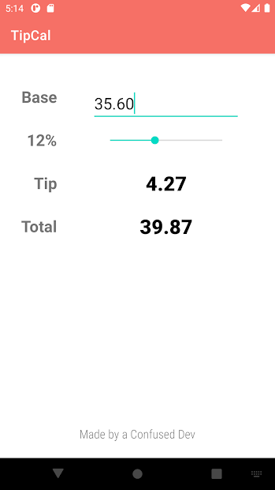
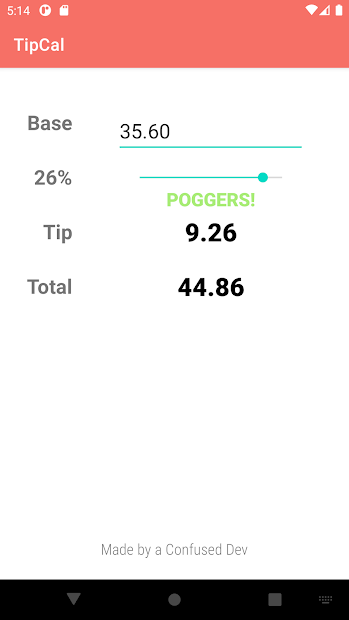

# TipCalAndroidApp
Check it out on the playstore https://play.google.com/store/apps/details?id=com.confuseddevs.tipcal 

Demo Video: Coming Soon

  </img>
  </img>

This is the first app I published to the playstore and learned to build using Android. It is a single screen app with dynamic text, animations, Android UI elements (seekbar, constraint layout) , color interpolation, smooth UX and splashscreens which I designed on Photoshop. A lot of dimensions can be added to this app such as integrating Room or a service like Firebase to allow users to store foods eaten and share restaurants visited with other users (actually, that sounds like a good app idea!?).

The app was a good starter for me on fullstack development for mobile apps and the biggest challenge was making the splashscreen responsive. It seems like if you have a PNG or JPG file, android will not resize the image based on the viewport. SVG formats do though. But my splashcreen was made on Photoshop and SVG export didn't render so well, so that led me to create 9 versions of the splashscreen with different resolutions and launch the approporiate one by reading the size of the viewport. 
